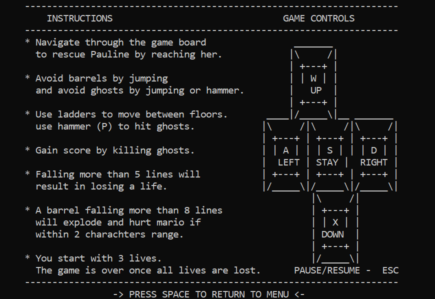
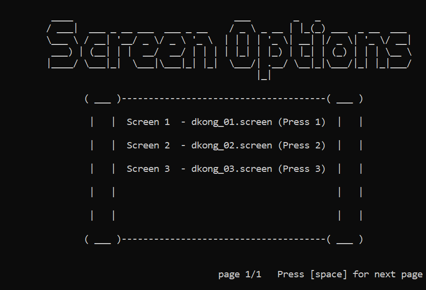
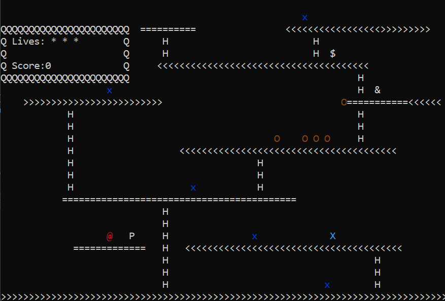
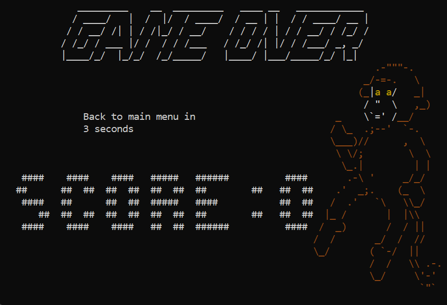
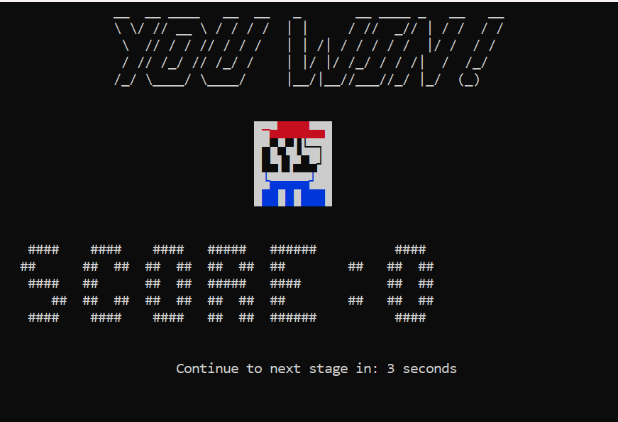

# Donkey Kong Console Game

## Overview
This is a console-based recreation of the classic **Donkey Kong** game, developed in C++.
The project implements various game mechanics such as Mario movement, barrels, ghosts, ladders, and the ultimate goal of rescuing Pauline.

### How to Play
The objective of the game is to control Mario (`@`) and navigate through obstacles to rescue Pauline (`$`). Donkey Kong (`&`) throws barrels (`O`), and ghosts (`x`) roam the platforms. Use ladders (`H`) to climb and a hammer (`p`) to destroy barrels and ghosts. If you reach Pauline, you win the level!

## Features
- **ASCII-based graphics** with optional **color mode**.
- **Dynamic game mechanics** including Mario (`@`), Donkey Kong (`&`), barrels (`O`), ghosts (`x`), ladders (`H`), and Pauline (`$`).
- **Multiple stages** loaded from `.screen` files.
- **Save and load functionality** for recording and replaying games.
- **Silent mode** (`-silent`) for automated result verification.
- **Organized file structure** for better maintainability.
- **CI/CD support (planned)** for automated testing.

## Installation & Execution
### **1. Clone the repository**
```sh
git clone https://github.com/adi0258/DonkeyKong.git
cd DonkeyKongConsoleGame
```

### **2. Open the project in Visual Studio**
- Open `donkeykong1.sln` in **Visual Studio 2022**.
- Build the project in **Release mode**.

### **3. Run the game**
Execute the compiled binary:
```sh
dkong.exe
```
Or with command-line options:
```sh
dkong.exe -load
```
```sh
dkong.exe -save
```
```sh
dkong.exe -silent
```

## Controls
- **LEFT**  → `A` / `a`
- **RIGHT** → `D` / `d`
- **UP / JUMP** → `W` / `w`
- **DOWN** → `X` / `x`
- **STAY** → `S` / `s`
- **Use Hammer** → `P` / `p`
- **Pause** → `ESC`

## Screenshots
### Main Menu

### instructions and controls,

### screen options

### Gameplay

### Game Over

### Winning Screen

## File Formats
The project includes:
- **`.screen` files**: Defines game levels.
- **`.steps` files**: Records movement steps.
- **`.result` files**: Stores expected results.

## Repository Enhancements
To improve the project structure and maintainability, the following updates were made:
- **Added a `.gitignore` file** to exclude compiled binaries and temporary files.
- **Organized file structure**:
  - `src/` → C++ source files.
  - `include/` → Header files.
  - `assets/` → Game assets (screens, steps, results).
  - `docs/` → Documentation and guides.
- **Planned CI/CD integration** using GitHub Actions for automated testing.
- **Added a LICENSE file (MIT)** to clarify usage permissions.
- **Included contributing guidelines (CONTRIBUTING.md)** to help new contributors.
- **Defined a Code of Conduct (CODE_OF_CONDUCT.md)** to maintain a welcoming environment.

## Contributors
- **Adi Tapiero**
- **Matan Gurfinkel**
